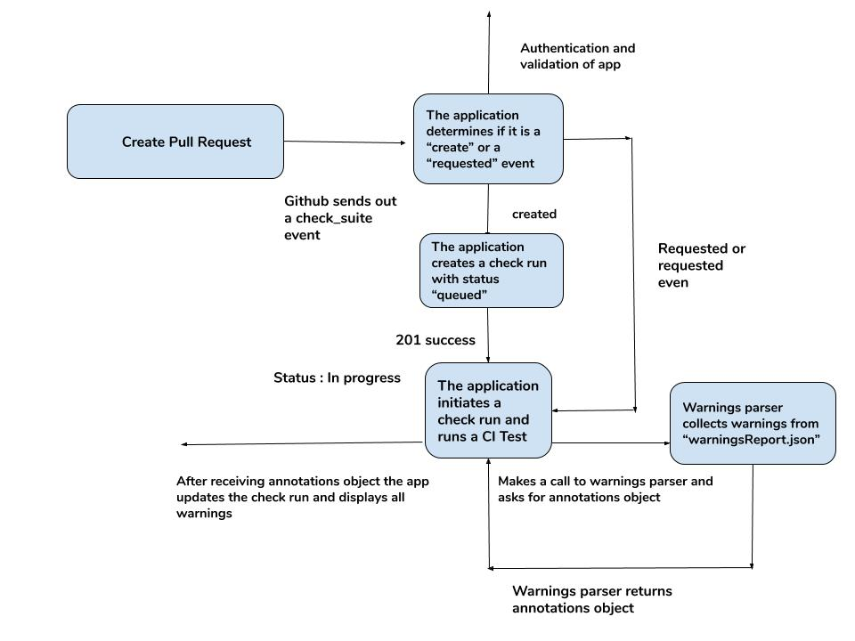
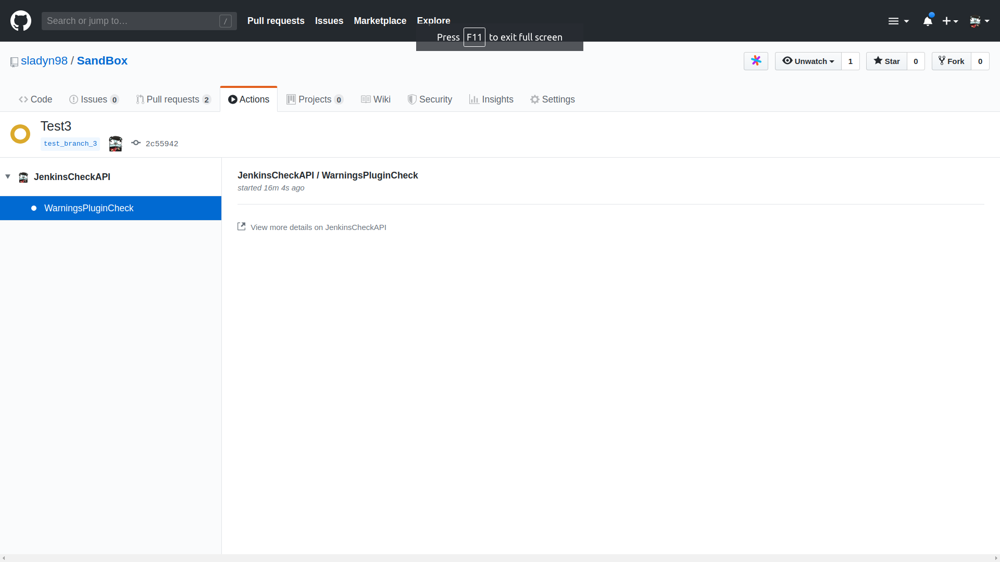
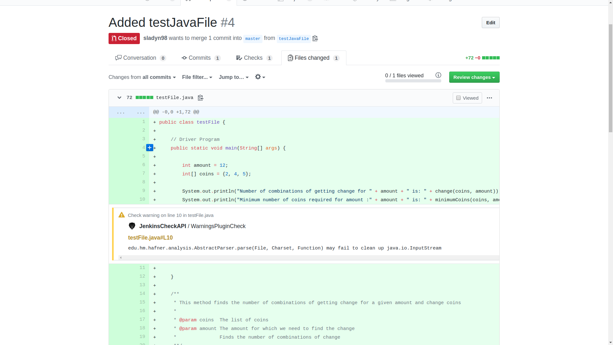

## Overview

  

This is a POC to create reports for the Warnings Plugin on pull requests using the Github Checks API.
Currently the project creates a check run and parses a simple warnings report.

:construction: This is just  a proof of concept. Expect dragons and unfinished business.The Warnings report here is just static and does not make any dynamic call:construction:

## Workflow

  

## ScreenShots

This is a screenshot of the checks Status

  

This is a screenshot of the Published Warnings Report.

  

